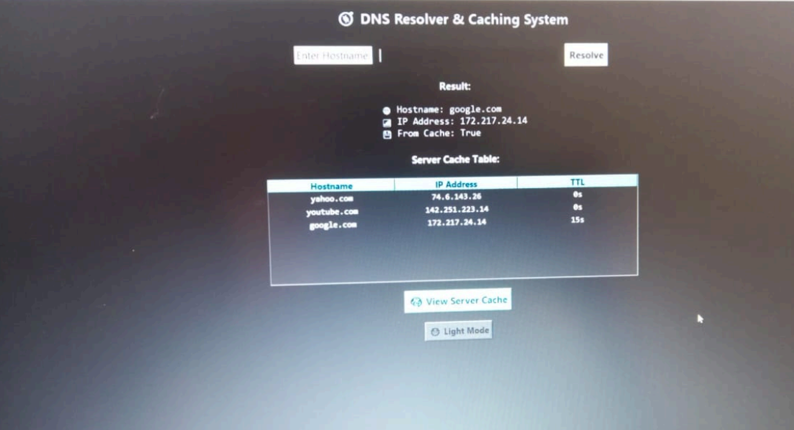
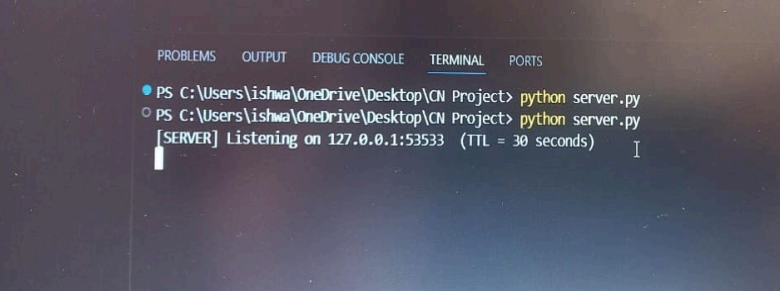

# 🌐 DNS Resolver with Caching

> A lightweight DNS resolution system built with Python, Flask, TCP socket communication, and local caching to demonstrate how DNS lookup and cache-based resolution work.


---

# 📸 DNS Resolver GUI



---

## 📌 Overview

DNS Resolver is a client-server based DNS resolution system developed using Python.

The application accepts domain names from a client, resolves them into IP addresses, and maintains a local cache to avoid repeated DNS lookups.

The system demonstrates the concepts of **DNS resolution, client-server communication, caching, cache hits, cache misses, and TTL-based cache expiration** through both command-line and graphical interfaces.

---

## ✨ Features

- 🌐 Domain name to IP address resolution
- ⚡ Local DNS caching
- 🔍 Cache Miss detection
- 🚀 Cache Hit optimization
- ⏱️ TTL-based cache expiration
- 🔌 TCP socket-based client-server communication
- 🖥️ Command-line DNS client
- 🪟 Graphical DNS resolver interface
- 📊 Cache table visualization
- 🌍 Support for multiple domain queries
- 🔄 Automatic fresh resolution after cache expiration

---

## 🛠️ Tech Stack

| Technology | Purpose |
|------------|---------|
| Python | Core application development |
| Flask | DNS resolver API server |
| TCP Sockets | Client-server communication |
| Tkinter | Graphical user interface |
| JSON | Request and response data exchange |
| DNS | Domain name resolution |
| Local Cache | Storing recently resolved domains |
| TTL | Controlling cache expiration |

---

## 🏗️ System Architecture

```text
                  User
                   │
                   ▼
          DNS Client / GUI
                   │
                   │ TCP / JSON
                   ▼
          Flask DNS API Server
                   │
             ┌─────┴─────┐
             │           │
             ▼           ▼
        Local Cache   DNS Resolver
             │           │
             │           ▼
             │      IP Address
             │
             ▼
       Cache Hit / Miss
             │
             ▼
          Client
```

---

## 🔄 DNS Resolution Workflow

```text
User enters domain
        │
        ▼
Check local cache
        │
   ┌────┴────┐
   │         │
 HIT       MISS
   │         │
   ▼         ▼
Return    Resolve
cached    domain
result       │
             ▼
        Store in cache
             │
             ▼
        Return IP address
```

---

## ⚡ Cache Mechanism

The resolver first checks whether the requested domain is already present in the local cache.

### Cache Hit

If a valid cached entry exists, the resolver immediately returns the stored IP address without performing another DNS lookup.

```text
Domain: google.com
From Cache: True
```

This reduces repeated DNS resolution work and improves response efficiency.

### Cache Miss

If the domain is not present in the cache, the resolver performs a fresh DNS lookup and stores the result.

```text
Domain: google.com
From Cache: False
```

---

## ⏱️ TTL-Based Cache Expiration

Cached DNS records are maintained only for a limited period.

When the TTL expires, the cached entry becomes invalid and the resolver performs a fresh DNS lookup.

This prevents stale DNS information from remaining in the cache indefinitely.

---

# 📂 Project Structure

```text
DNS-Resolver/
│
├── dns_api_server.py
├── dns_cli_client_api.py
├── dns_gui_client_toggle.py
│
├── screenshots/
│   ├── server-running.png
│   ├── cache-miss.png
│   ├── cache-hit.png
│   └── dns-gui.png
│
├── .gitignore
└── README.md
```

---

# 🚀 Getting Started

## 1. Clone the Repository

```bash
git clone https://github.com/Ishwari345/DNS-Resolver.git
```

```bash
cd DNS-Resolver
```

---

## 2. Start the DNS API Server

```bash
python dns_api_server.py
```

The server runs locally on:

```text
http://127.0.0.1:8080
```

---

## 3. Run the Command-Line Client

Open another terminal:

```bash
python dns_cli_client_api.py
```

Enter a domain name to perform DNS resolution.

---

## 4. Run the GUI

```bash
python dns_gui_client_toggle.py
```

The graphical interface provides an interactive way to perform DNS lookups and view cached results.

---

# 📸 Project Screenshots

## 🖥️ DNS Server Running

Flask DNS API server running locally and listening for client requests.



---

## 🔍 First DNS Query — Cache Miss

The first request for a domain performs a fresh DNS resolution because the domain is not yet available in the local cache.


---

## ⚡ Second DNS Query — Cache Hit

A repeated request for the same domain is served directly from the local cache.


---

## 🪟 DNS Resolver GUI

The graphical interface provides domain resolution and displays cached DNS information.


---

# 🎯 Key Highlights

- Demonstrates practical DNS resolution
- Implements client-server networking
- Uses TCP socket communication
- Demonstrates cache hit and cache miss behavior
- Implements TTL-based cache expiration
- Provides both CLI and GUI interfaces
- Visualizes cached DNS records
- Demonstrates concepts from Computer Networks through a working application

---

# 🔮 Future Enhancements

- Multi-level DNS caching
- Configurable TTL values
- Support for additional DNS record types
- DNS query history
- Performance analytics
- Concurrent client handling
- Docker-based deployment
- Enhanced GUI and monitoring dashboard

---

# 👩‍💻 Author

**Ishwari Bagewadi**

Information Science Engineering Student

GitHub: https://github.com/Ishwari345

---

#  Acknowledgements

- Python
- Flask
- Tkinter
- Computer Networks concepts
- DNS architecture
- Open Source Community